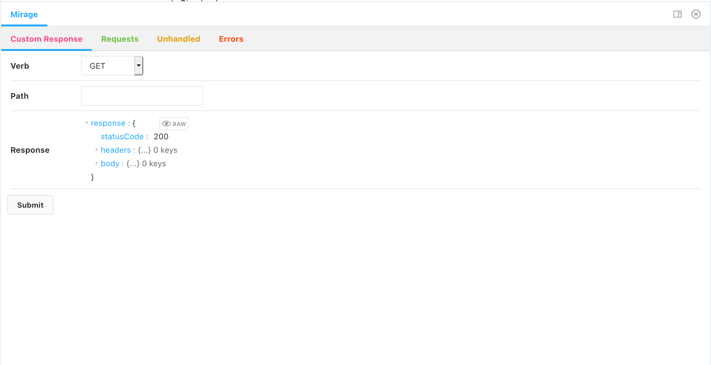
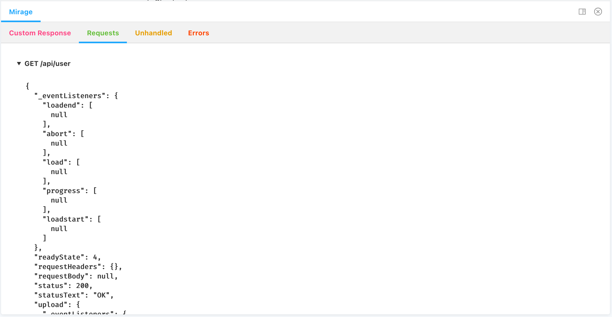

# Storybook Mirage

A Storybook addon to use and interact with a [MirageJS server](https://miragejs.com/)

_Created with [Storybook Addon Kit](https://github.com/storybookjs/addon-kit)_

## What's included?

Set custom request handlers from Storybook:


View request logs:


## Getting Started

_TBD: installation and setup instructions_

### Development scripts

- `npm run start` runs babel in watch mode and starts Storybook
- `npm run build` build and package addon code

The addon code lives in `src`.

- `src/Panel.js` (displays server requests and handler stats)
- `src/withServer.js` (decorator to consume and configure MirageJS server)

Which, along with the addon itself, are registered in `src/preset/manager.js`.

Configure addon name in `src/constants.js`.

### Metadata

Storybook addons are listed in the [catalog](https://storybook.js.org/addons) and distributed via npm. The catalog is populated by querying npm's registry for Storybook-specific metadata in `package.json`. This project has been configured with sample data. Learn more about available options in the [Addon metadata docs](https://storybook.js.org/docs/react/addons/addon-catalog#addon-metadata).

## Release Management

### Setup

This project is configured to use [auto](https://github.com/intuit/auto) for release management. It generates a changelog and pushes it to both GitHub and npm. Therefore, you need to configure access to both:

- [`NPM_TOKEN`](https://docs.npmjs.com/creating-and-viewing-access-tokens#creating-access-tokens) Create a token with both _Read and Publish_ permissions.
- [`GH_TOKEN`](https://github.com/settings/tokens) Create a token with the `repo` scope.

Then open your `package.json` and edit the following fields:

- `name`
- `author`
- `repository`

#### Local

To use `auto` locally create a `.env` file at the root of your project and add your tokens to it:

```bash
GH_TOKEN=<value you just got from GitHub>
NPM_TOKEN=<value you just got from npm>
```

Lastly, **create labels on GitHub**. You’ll use these labels in the future when making changes to the package.

```bash
npx auto create-labels
```

If you check on GitHub, you’ll now see a set of labels that `auto` would like you to use. Use these to tag future pull requests.

#### GitHub Actions

This template comes with GitHub actions already set up to publish your addon anytime someone pushes to your repository.

Go to `Settings > Secrets`, click `New repository secret`, and add your `NPM_TOKEN`.

### Creating a releasing

To create a release locally you can run the following command, otherwise the GitHub action will make the release for you.

```sh
npm run release
```

That will:

- Build and package the addon code
- Bump the version
- Push a release to GitHub and npm
- Push a changelog to GitHub
